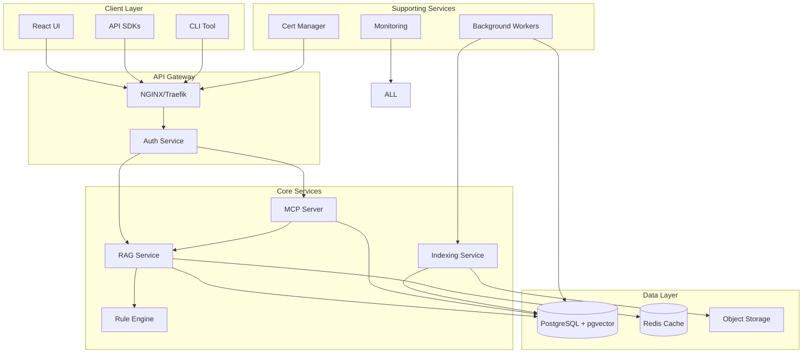

# RAG-as-a-Service Backend Architecture

## System Architecture Overview



## Core Components

### 1. PostgreSQL Database Schema

```sql
-- Main database with pgvector and pgai extensions
CREATE EXTENSION IF NOT EXISTS vector;
CREATE EXTENSION IF NOT EXISTS pgai;

-- Organizations (multi-tenancy)
CREATE TABLE organizations (
    id UUID PRIMARY KEY DEFAULT gen_random_uuid(),
    name VARCHAR(255) NOT NULL,
    slug VARCHAR(255) UNIQUE NOT NULL,
    settings JSONB DEFAULT '{}',
    created_at TIMESTAMPTZ DEFAULT NOW()
);

-- Users with RBAC
CREATE TABLE users (
    id UUID PRIMARY KEY DEFAULT gen_random_uuid(),
    email VARCHAR(255) UNIQUE NOT NULL,
    password_hash VARCHAR(255) NOT NULL,
    organization_id UUID REFERENCES organizations(id),
    roles TEXT[] DEFAULT '{}',
    created_at TIMESTAMPTZ DEFAULT NOW()
);

-- API Keys with scoped permissions
CREATE TABLE api_keys (
    id UUID PRIMARY KEY DEFAULT gen_random_uuid(),
    key_hash VARCHAR(255) UNIQUE NOT NULL,
    user_id UUID REFERENCES users(id),
    name VARCHAR(255),
    scopes TEXT[] DEFAULT '{}',
    expires_at TIMESTAMPTZ,
    last_used_at TIMESTAMPTZ,
    created_at TIMESTAMPTZ DEFAULT NOW()
);

-- Data Sources
CREATE TABLE data_sources (
    id UUID PRIMARY KEY DEFAULT gen_random_uuid(),
    organization_id UUID REFERENCES organizations(id),
    name VARCHAR(255) NOT NULL,
    type VARCHAR(50) NOT NULL, -- 'file', 'database', 'api', 'sharepoint'
    config JSONB NOT NULL, -- encrypted connection details
    labels TEXT[] DEFAULT '{}',
    refresh_schedule VARCHAR(50), -- cron expression
    last_refresh TIMESTAMPTZ,
    created_at TIMESTAMPTZ DEFAULT NOW()
);

-- Documents with references only
CREATE TABLE documents (
    id UUID PRIMARY KEY DEFAULT gen_random_uuid(),
    data_source_id UUID REFERENCES data_sources(id),
    external_id VARCHAR(255), -- ID in source system
    url TEXT NOT NULL, -- reference URL/path
    title TEXT,
    metadata JSONB DEFAULT '{}',
    content_hash VARCHAR(64), -- SHA256 of content
    last_modified TIMESTAMPTZ,
    created_at TIMESTAMPTZ DEFAULT NOW(),
    UNIQUE(data_source_id, external_id)
);

-- Embeddings with pgai trigger
CREATE TABLE embeddings (
    id UUID PRIMARY KEY DEFAULT gen_random_uuid(),
    document_id UUID REFERENCES documents(id) ON DELETE CASCADE,
    chunk_number INTEGER NOT NULL,
    content TEXT NOT NULL,
    embedding vector(1536), -- for text-embedding-ada-002
    sparse_embedding JSONB, -- SPLADE sparse vectors
    metadata JSONB DEFAULT '{}',
    created_at TIMESTAMPTZ DEFAULT NOW(),
    UNIQUE(document_id, chunk_number)
);

-- Create pgai trigger for automatic embedding generation
CREATE OR REPLACE FUNCTION generate_embedding() RETURNS TRIGGER AS $$
BEGIN
    -- This will be replaced with actual pgai embedding function
    -- NEW.embedding = pgai.embed('text-embedding-ada-002', NEW.content);
    RETURN NEW;
END;
$$ LANGUAGE plpgsql;

CREATE TRIGGER auto_embed 
    BEFORE INSERT OR UPDATE ON embeddings
    FOR EACH ROW 
    WHEN (NEW.embedding IS NULL)
    EXECUTE FUNCTION generate_embedding();

-- Indexes for vector search
CREATE INDEX idx_embeddings_vector ON embeddings 
    USING ivfflat (embedding vector_cosine_ops) WITH (lists = 100);

-- RAG Configurations
CREATE TABLE rag_configs (
    id UUID PRIMARY KEY DEFAULT gen_random_uuid(),
    organization_id UUID REFERENCES organizations(id),
    name VARCHAR(255) NOT NULL,
    description TEXT,
    config JSONB NOT NULL, -- all RAG parameters
    is_default BOOLEAN DEFAULT FALSE,
    created_at TIMESTAMPTZ DEFAULT NOW()
);

-- Rules and Guardrails
CREATE TABLE rules (
    id UUID PRIMARY KEY DEFAULT gen_random_uuid(),
    organization_id UUID REFERENCES organizations(id),
    name VARCHAR(255) NOT NULL,
    type VARCHAR(50) NOT NULL, -- 'guardrail', 'business_logic', 'filter'
    condition JSONB NOT NULL,
    action JSONB NOT NULL,
    priority INTEGER DEFAULT 0,
    is_active BOOLEAN DEFAULT TRUE,
    created_at TIMESTAMPTZ DEFAULT NOW()
);

-- Query History and Analytics
CREATE TABLE query_history (
    id UUID PRIMARY KEY DEFAULT gen_random_uuid(),
    user_id UUID REFERENCES users(id),
    query_text TEXT NOT NULL,
    rag_config_id UUID REFERENCES rag_configs(id),
    response TEXT,
    citations JSONB DEFAULT '[]',
    metrics JSONB DEFAULT '{}', -- timing, tokens, costs
    feedback INTEGER, -- 1-5 rating
    created_at TIMESTAMPTZ DEFAULT NOW()
);

-- Service Desk Integration Tables
CREATE TABLE sd_connections (
    id UUID PRIMARY KEY DEFAULT gen_random_uuid(),
    organization_id UUID REFERENCES organizations(id),
    name VARCHAR(255) NOT NULL,
    db_type VARCHAR(50) NOT NULL, -- 'postgres', 'mysql', 'oracle'
    connection_string TEXT NOT NULL, -- encrypted
    table_mappings JSONB NOT NULL,
    sync_schedule VARCHAR(50),
    last_sync TIMESTAMPTZ,
    created_at TIMESTAMPTZ DEFAULT NOW()
);
```

### 2. Core Services Architecture

#### RAG Service (FastAPI)
```python
# Main RAG service structure
app/
├── api/
│   ├── v1/
│   │   ├── auth.py      # JWT authentication
│   │   ├── chat.py      # Chat endpoints
│   │   ├── search.py    # Search endpoints
│   │   ├── admin.py     # Admin endpoints
│   │   └── config.py    # Configuration endpoints
├── core/
│   ├── rag.py          # RAG implementation
│   ├── embeddings.py   # Embedding generation
│   ├── reranking.py    # Reranking logic
│   ├── rules.py        # Rule engine
│   └── security.py     # RBAC implementation
├── db/
│   ├── models.py       # SQLAlchemy models
│   ├── vector.py       # pgvector operations
│   └── crud.py         # Database operations
└── utils/
    ├── cache.py        # Redis caching
    ├── crypto.py       # Encryption utilities
    └── monitoring.py   # Metrics collection
```

#### MCP Server Architecture
```python
# Enhanced MCP server for advanced operations
mcp_server/
├── tools/
│   ├── analytics.py    # Advanced analytics
│   ├── llm_chains.py   # Complex LLM workflows
│   ├── notifications.py # Alert management
│   └── data_ops.py     # Data operations
├── core/
│   ├── auth.py         # MCP authentication
│   └── registry.py     # Tool registry
└── api/
    └── endpoints.py    # MCP endpoints
```

### 3. Security Architecture

#### SSL/TLS Configuration
- **Nginx Reverse Proxy**: Terminates SSL for all services
- **Let's Encrypt Integration**: Automatic certificate renewal
- **mTLS**: Between internal services
- **Certificate Store**: PostgreSQL encrypted storage

#### RBAC Implementation
```python
# Permission model
PERMISSIONS = {
    "admin": ["*"],
    "developer": [
        "rag:read", "rag:write", "rag:config",
        "data:read", "data:write",
        "api:manage"
    ],
    "analyst": [
        "rag:read", "data:read",
        "query:write", "query:read"
    ],
    "viewer": ["rag:read", "query:read"]
}

# Scope-based API access
API_SCOPES = {
    "search": ["rag:read"],
    "index": ["data:write"],
    "admin": ["*"]
}
```

### 4. Deployment Architecture

#### Docker Compose (Development)
```yaml
version: '3.8'
services:
  postgres:
    image: pgvector/pgvector:pg16
    environment:
      POSTGRES_PASSWORD: ${DB_PASSWORD}
    volumes:
      - postgres_data:/var/lib/postgresql/data
    
  redis:
    image: redis:7-alpine
    volumes:
      - redis_data:/data
  
  rag-api:
    build: ./rag-service
    environment:
      DATABASE_URL: ${DATABASE_URL}
      REDIS_URL: ${REDIS_URL}
      OPENAI_API_KEY: ${OPENAI_API_KEY}
    depends_on:
      - postgres
      - redis
  
  mcp-server:
    build: ./mcp-server
    depends_on:
      - rag-api
  
  nginx:
    image: nginx:alpine
    ports:
      - "443:443"
    volumes:
      - ./nginx.conf:/etc/nginx/nginx.conf
      - ./certs:/etc/nginx/certs
    depends_on:
      - rag-api
      - mcp-server
  
  frontend:
    build: ./frontend
    environment:
      REACT_APP_API_URL: https://localhost/api

volumes:
  postgres_data:
  redis_data:
```

#### Kubernetes Deployment
```yaml
# Helm chart structure
helm/
├── charts/
├── templates/
│   ├── deployment-api.yaml
│   ├── deployment-mcp.yaml
│   ├── deployment-frontend.yaml
│   ├── service.yaml
│   ├── ingress.yaml
│   ├── configmap.yaml
│   ├── secret.yaml
│   └── pvc.yaml
└── values.yaml
```

#### Single Script Installation
```bash
#!/bin/bash
# install.sh - One-click installation script

# Check prerequisites
check_prerequisites() {
    command -v docker >/dev/null 2>&1 || { echo "Docker required"; exit 1; }
    command -v docker-compose >/dev/null 2>&1 || { echo "Docker Compose required"; exit 1; }
}

# Setup PostgreSQL with pgvector
setup_database() {
    docker run -d \
        --name ragaas-postgres \
        -e POSTGRES_PASSWORD=$DB_PASSWORD \
        -p 5432:5432 \
        pgvector/pgvector:pg16
    
    # Wait for DB and install extensions
    sleep 10
    docker exec ragaas-postgres psql -U postgres -c "CREATE EXTENSION vector;"
    docker exec ragaas-postgres psql -U postgres -c "CREATE EXTENSION pgai;"
}

# Deploy services
deploy_services() {
    docker-compose up -d
}

# Main installation flow
main() {
    check_prerequisites
    setup_database
    deploy_services
    echo "RAG-as-a-Service installed successfully!"
    echo "Access UI at: https://localhost"
}
```

### 5. Integration with pgai

```sql
-- Configure pgai for automatic embeddings
SELECT pgai.config_set('openai.api_key', 'your-api-key');

-- Create embedding function
CREATE OR REPLACE FUNCTION generate_embedding_pgai() RETURNS TRIGGER AS $$
BEGIN
    NEW.embedding = pgai.openai_embed(
        'text-embedding-ada-002',
        NEW.content,
        api_key => pgai.config_get('openai.api_key')
    );
    RETURN NEW;
END;
$$ LANGUAGE plpgsql;

-- Update trigger
DROP TRIGGER IF EXISTS auto_embed ON embeddings;
CREATE TRIGGER auto_embed 
    BEFORE INSERT OR UPDATE ON embeddings
    FOR EACH ROW 
    WHEN (NEW.embedding IS NULL)
    EXECUTE FUNCTION generate_embedding_pgai();
```

### 6. Service Desk Integration Example

```python
# Service desk data sync
class ServiceDeskSync:
    def __init__(self, connection_config):
        self.source_db = create_engine(connection_config['connection_string'])
        self.target_db = get_db_session()
    
    async def sync_tickets(self):
        # Read from service desk
        query = """
        SELECT 
            ticket_id as external_id,
            title,
            description as content,
            created_date,
            updated_date,
            category,
            priority
        FROM tickets
        WHERE updated_date > :last_sync
        """
        
        tickets = self.source_db.execute(query, last_sync=self.last_sync)
        
        # Transform and insert
        for ticket in tickets:
            doc = Document(
                data_source_id=self.data_source_id,
                external_id=ticket['external_id'],
                url=f"servicedesk://tickets/{ticket['external_id']}",
                title=ticket['title'],
                metadata={
                    'category': ticket['category'],
                    'priority': ticket['priority']
                }
            )
            self.target_db.add(doc)
            
            # Content will be automatically embedded via trigger
            embedding = Embedding(
                document_id=doc.id,
                chunk_number=1,
                content=ticket['content']
            )
            self.target_db.add(embedding)
```

This architecture provides:
1. **No vendor lock-in**: Uses open-source PostgreSQL, pgvector, and optional OpenAI
2. **Easy deployment**: Single script, Docker, or Kubernetes options
3. **Security**: RBAC, SSL/TLS, encrypted storage
4. **Scalability**: Microservices architecture
5. **Flexibility**: Rule engine, multiple data sources, configurable RAG